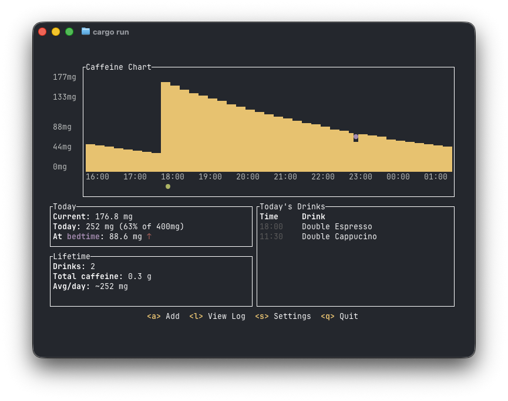
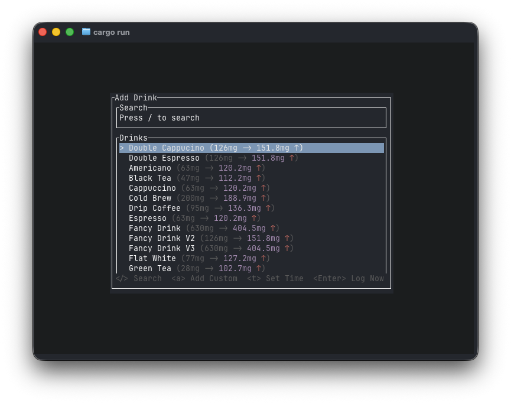
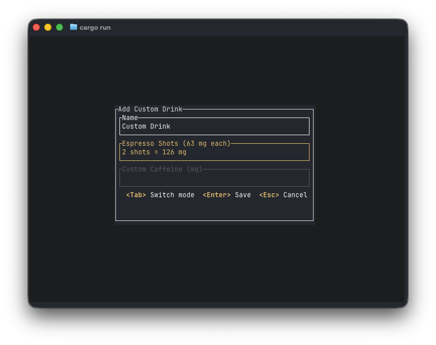
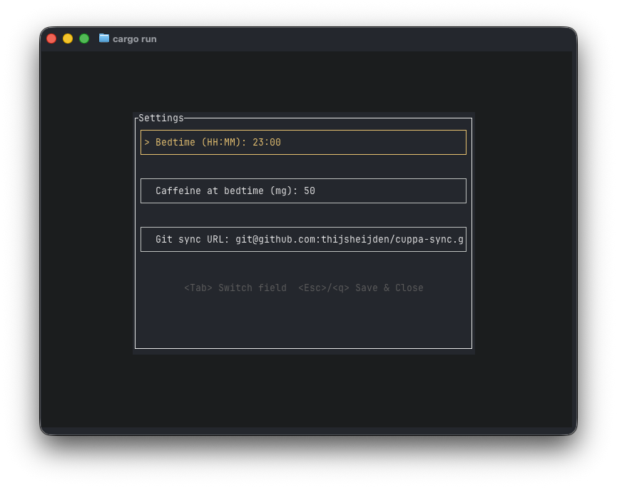
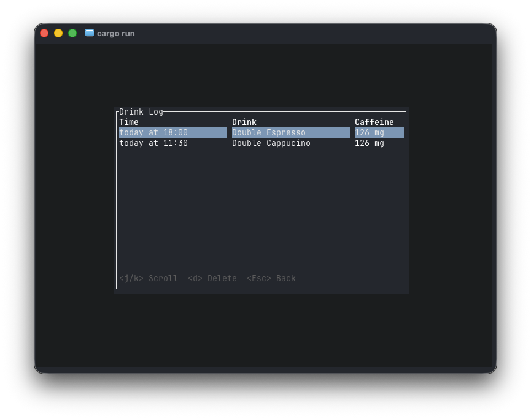

# Cuppa

    A terminal-based caffeine tracker with Vim keybinds and Git sync.

<p align="center">
  
</p>

## Overview

**Cuppa** is a TUI (Terminal User Interface) application for tracking your daily caffeine intake. It provides a fast, keyboard-driven interface for logging drinks, visualizing caffeine levels over time, and it can keep your data in sync across devices via Git.

## Features

- **Track caffeine intake** — Log drinks and see your current caffeine level.
- **Visualize levels over time** — See how your caffeine will decay throughout the day and when it will drop below your bedtime threshold.
- **Custom drink types** — Add your own drinks with custom caffeine amounts (by espresso shot or exact mg).
- **Git-based sync** — Sync your drink log across machines by pointing Cuppa at a Git repository. Background pull on startup, push on exit.
- **Bedtime awareness** — Set your bedtime and a caffeine threshold to see when your caffeine level is sleep-ready .

### Screenshots

| Home | Add Drink |
|------|-----------|
|  |  |

| Custom Drink Types | Settings |
|-------------------|----------|
|  |  |

| Log | 
|-------------------|
|  |

## Installation

### Homebrew (macOS / Linux)

```bash
brew tap thijsheijden/cuppa
brew install cuppa # You might have to trust the tap, or use --force to trust and install
```

### From source

```bash
git clone https://github.com/thijsheijden/cuppa.git
cd cuppa
cargo install --path .
```

### Updating
```bash
brew update
brew upgrade cuppa
```

## Usage

Launch Cuppa from your terminal:

```bash
cuppa
```

## Sync

Cuppa can sync your drink log across devices using a Git repository:

1. Open **Settings** (`g` + `s`)
2. Set a **Sync Remote URL** (e.g. a private GitHub repo)
3. Cuppa will automatically pull on startup and push your changes when you quit

Sync works by recording drink operations (add / delete) as JSON log entries in a Git-backed directory, then replaying missing operations on each device. This means that if two instances run at the same time and sync to the same repository there will be conflicts. Cuppa is designed to have at most one instance running at once.
